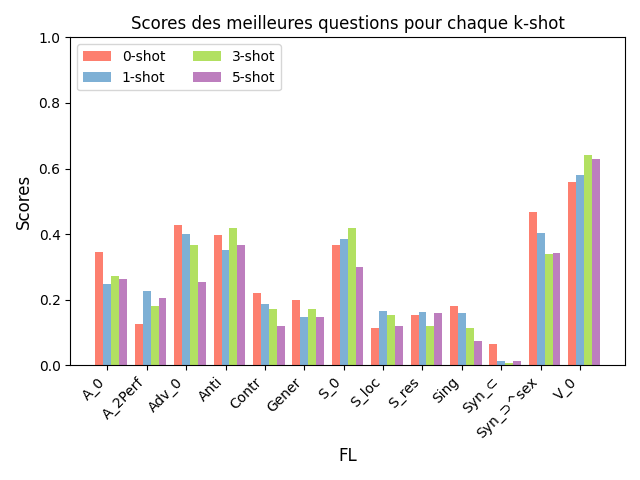

# La théorie des fonctions lexicales appliquée pour tester des grands modèles de langages

### Motivation
L'objectif de notre projet est de mettre en pratique la théorie des fonctions lexicales présentée par le [Réseau lexical du Français](https://www.ortolang.fr/market/lexicons/lexical-system-fr/v3.1) pour tester la performance de modèles de langages par rapport à des questions linguistiques. Nous avons utilisé les fonctions lexicales présentées dans cette théorie ainsi que leurs exemples pour voir si il était possible de créer des questions qui généralisaient bien chaque fonction, peu importe la classe du mot en entrée (verbe, nom, clausation, etc). De plus, nous voulions pouvoir mesurer la performance d'un modèle de langage avec certaines questions définies à l'avance. Nous voulions aussi voir si il était possible d'imposer une forme de sortie au modèle (réponse en un seul mot en français).

### Qu'est-ce qu'une fonction lexicale?
La théorie Sens-Texte (TST ou ST) est une approche linguistique proposée d’abord par Igor Mel’čuk en 1965, puis approfondie par Alain Polguère. Son objectif principal est de formaliser les représentations d’énoncés linguistiques entre eux par rapport à leurs représentations textuelles, puis par rapport à leurs sens. Elle vise à faire cette formalisation de la manière la plus “universelle” possible, afin de construire des modèles linguistiques généralisables à toute langue humaine en reposant sur des concepts élémentaires. 

Les fonctions lexicales (FLs) sont un outil développé dans le cadre de l’approche ST qui permet de modéliser formellement des phénomènes linguistiques fondamentaux de toute langue. 

Les FLs peuvent être vues comme des fonctions mathématiques ou des méthodes au sein d’un programme. Elles retournent une liste unique de lexies selon leur comportement et la lexie fournie en argument. 

Par exemple:
$A_1$(douter) = *dubitatif, dans le doute*

Ici, $A_1$ est la FL pour obtenir le qualificatif adjectival typique $A_i$ du premier actant syntaxique profond (le sujet) de son argument (i = 1). On peut, en effet, dire que “X (le sujet) est *dans le doute*”. 

## Déroulement des tests
1. Extraction des mots d'entrée et de sortie pour chaque fonction lexicale contenus dans la ressource et mise sous forme de maps.
2. Génération d'échantillons aléatoires de taille 50 pour toutes les fonctions lexicales contenant au moins 70 exemples.
3. Test de chaque question rédigée sur les fonctions lexicales sélectionnées, en utilisant le traitement en batch d'Ollama
4. Collecte des réponses du modèle et génération de Dataframes à partir des données
5. Génération de tables et figures pour présenter les résultats

## Résultats
  

Les k-shots représentent le nombre d'exemples ajoutés à la question donnée au modèle de langage. Par exemple, une question avec 3 exemples pourrait être: 

    Quel est l'adjectif correspondant au mot [x]? Donne un seul adjectif sans ponctuation. 
    
    Voici 3 exemples: 
    Pour "temps", la réponse est "temporel". 
    Pour "se nourrir", la réponse est "nutritionnel".
    Pour "rotation", la réponse est "giratoire".

Le lien vers le site Web:   
https://alessmcs.github.io/index.html
